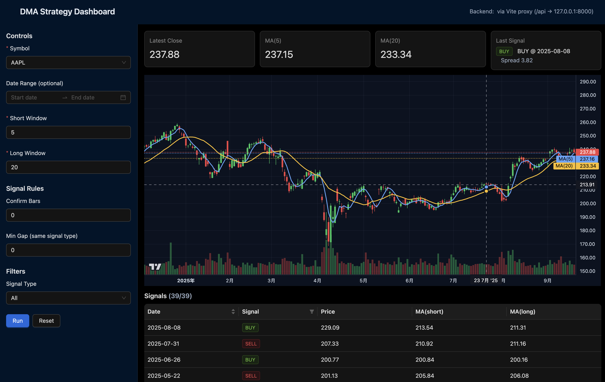

# dma-frontend

DMA 策略看板前端（React），用于展示行情、均线与交易信号，并与 `dma-strategy-backend` 的 API 对接。

## Demo



## 技术栈

- React 19 + TypeScript + Vite
- UI：Ant Design
- 数据请求：Axios
- 服务端状态：@tanstack/react-query
- 图表（MVP）：TradingView `lightweight-charts`（Candlestick + MA + volume + markers）
- 时间：Day.js

## 本地开发启动

### 1) 安装依赖

```bash
npm install
```

### 2) 启动开发服务器

```bash
npm run dev
```

Vite 默认监听 `0.0.0.0:5173`（见 `vite.config.ts`），浏览器访问 `http://localhost:5173/`。

开发环境已在 `vite.config.ts` 配置代理：`/api` → `http://127.0.0.1:8000`，因此默认不需要额外配置 CORS 或 baseURL。

## 构建与检查

- 构建：`npm run build`
- 预览：`npm run preview`
- Lint：`npm run lint`

## 环境变量（建议）

可通过 Vite 环境变量配置后端 API 地址，在项目根目录新建 `.env.local`：

```bash
VITE_API_BASE_URL=http://127.0.0.1:8000
```

代码中可通过 `import.meta.env.VITE_API_BASE_URL` 读取并作为 Axios 的 `baseURL`；若未设置则默认走 Vite 代理（相对路径 `/api`，推荐）。

## 与后端对接（参考）

后端（MVP）提供以下接口（以 `VITE_API_BASE_URL` 为前缀，或直接使用 `/api` 代理）：

- `GET /api/codes/`：可用代码列表（下拉框数据源）
- `GET /api/stock-data/`：行情与均线数据
- `GET /api/signals/`：交易信号（返回 `{ data, meta }`，并支持 `gen_*` 与 `filter_*` 参数）

当前 MVP 不需要 JWT。

## 目录结构

- `src/main.tsx`：应用入口
- `src/App.tsx`：Dashboard 页面（Controls + Status + Chart + Signals）
- `public/`：静态资源

## 高级策略模式（Advanced）

后端已支持 `strategy_mode=advanced`（仅用于 `/api/stock-data/` 的 `include_performance=true` 回测），前端在 Dashboard 的 Controls 面板提供了：

- `Strategy Mode`：`Basic` / `Advanced`
- Advanced 模式下的参数面板（Ensemble / Regime / Vol Targeting / Exits）

使用步骤：

1) 打开 `Benchmark`（Advanced 会自动强制开启）
2) 将 `Strategy Mode` 设为 `Advanced`
3) 确保 `ensemble_pairs` 有值（例如 `5:20,10:50,20:100,50:200`）
4) 点击 `Run`

请求会自动带上 `include_performance=true&strategy_mode=advanced`，并将参数映射到后端 query params。
